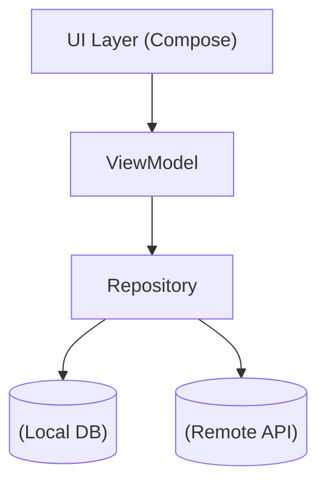

# Farmer Weather App ☀️

공공데이터포털의 기상청 단기예보 Open API를 활용하여 현재 위치 기반 실시간 날씨 정보를 제공하는 안드로이드 앱입니다.

 
  
## 주요 기능
- 현재 위치 기반 날씨 표시
- 다크모드 지원
- 강수량 표시

 

## 스크린샷

 
 

## 기술 스택
- **Language**: Kotlin
- **UI**: Jetpack Compose
- **Architecture**: MVVM + DI(Hilt)
- **Data**: Room (Local DB), Retrofit(API)
- **API**: 기상청 공공데이터 API
- **Crash Reporting**: Firebase Crashlytics

 

## 아키텍처

 

## 주요 문제 해결
- **API 실패 시 앱 크래시**
  - 원인: ViewModel에서 상태 제어 로직이 분리되어, 실패 후에도 다음 프로세스 실행
  - 해결: 상태 제어를 한 곳에 통합, 실패 시 흐름 중단 처리

- **API 응답 데이터의 조건별 제한**
  - 예: 최고/최저기온은 당일 02시 이전에만 조회 가능 -> 요청 시간 조건 처리
  - 예: '단기실황'에서 비가 오지 않을 경우 상세 날씨 미제공 -> '예보' 데이터로 보완

 

## 개선 계획
- 테스트 코드 작성: JUnit5 기반 단위 테스트 및 UI 테스트 추
- 지역 검색 및 즐겨찾기: Kakao Map API 활용, 원하는 지역의 날씨 조회 지원

 

## 확인 방법
현재 Google Play 비공개 테스트 단계입니다.
테스터로 등록된 계정만 설치 가능합니다.
[비공개 테스트 앱 링크](https://play.google.com/store/apps/details?id=com.farmer.weather)

 

## Assets Attribution
- 날씨 아이콘: [미리캔버스](https://www.miricanvas.com/) AI generated
- error icon: [Flaticon](https://www.flaticon.com/free-icons/cross)
- nodata icon: [Flaticon](https://www.flaticon.com/free-icons/cancel)

