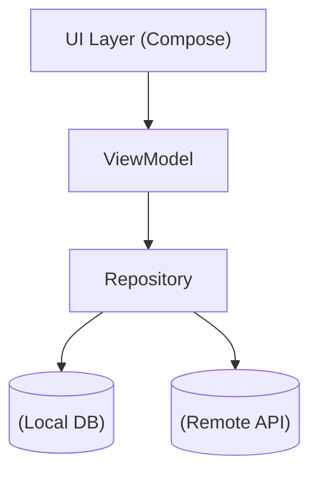

# Farmer Weather App ☀️

농업 종사자를 위한 날씨 앱입니다
특히 시니어 사용자를 고려해 큰 글씨와 단순 UI를 적용했습니다

 
  
## 주요 기능
- 현재 위치 기반 날씨 표시: GPS로 사용자 입력 없이 날씨 확인
- 강수량 및 레이더 시각화: 강수량이 농업에서 중요한 경우가 많으니 시간대별 강수확률과 예상 강우량을 함께 표시함
- 시니어 친화 UI: 큰 글씨, 단순한 탭으로 접근성 강화

 

## 스크린샷

  
  

 
 

## 기술 스택
| 분야            | 기술                        | 비고/도입 이유            |
|-----------------|-----------------------------|---------------------|
| **Language**    | Kotlin                      | Android 공식 언어       |
| **UI**          | Jetpack Compose             | 최신 UI 적용, 코드량 절감    |
| **Architecture**| MVVM + Hilt (DI)            | 책임 분배, 테스트 용이       |
| **Data**        | Room (Local DB), Retrofit   | 네트워크 비용 절감, 오프라인 지원 |
| **API**         | 기상청 공공데이터 API       | 무료, 실생활 사용          |
| **Crash Report**| Firebase Crashlytics        | 무료, 오류 모니터링 및 개선    |

 

## 아키텍처

 

## 주요 문제 해결
- **API 실패 시 앱 크래시**
  - 원인: ViewModel에서 상태 제어 로직이 분리되어, 실패 후에도 다음 프로세스 실행
  - 해결: 상태 제어를 한 곳에 통합, 실패 시 흐름 중단 처리

- **API 응답 데이터의 조건별 제한**
  - 예: 최고/최저기온은 당일 02시 이전에만 조회 가능 -> 요청 시간 조건 처리
  - 예: '단기실황'에서 비가 오지 않을 경우 상세 날씨 미제공 -> '예보' 데이터로 보완

 

## 개선 계획
- 테스트 코드 작성: JUnit5 기반 단위 테스트 및 UI 테스트 추
- 지역 검색 및 즐겨찾기: Kakao Map API 활용, 원하는 지역의 날씨 조회 지원

 

## 확인 방법
[GitHub Release 에서 APK 다운로드](https://github.com/DodoNehir/FarmerWeatherApp/releases/tag/v1.0.0)
- 설치 시 알 수 없는 출처 허용 필요할 수 있음

※ 참고: Google Play 비공개 테스트 단계도 진행중
[테스터로 등록된 계정만 설치 가능](https://play.google.com/store/apps/details?id=com.farmer.weather)

 

## Assets Attribution
- 날씨 아이콘: [미리캔버스](https://www.miricanvas.com/) AI generated
- error icon: [Flaticon](https://www.flaticon.com/free-icons/cross)
- nodata icon: [Flaticon](https://www.flaticon.com/free-icons/cancel)

 

### **사용자 경험을 개선하고 안정적인 앱 개발에 중점을 두고자 합니다**